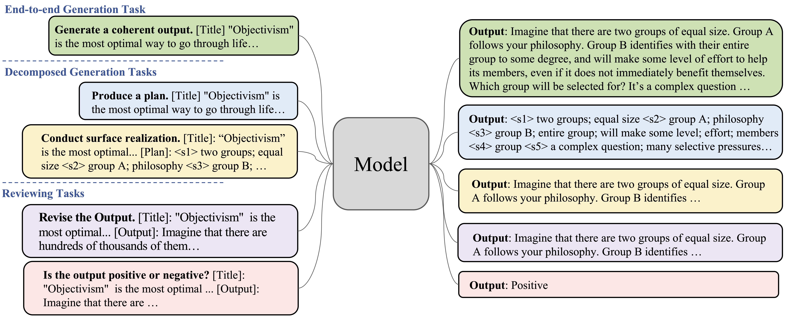

# Mocha-EMNLP22 ☕️

This repository contains data and code for MOCHA in our EMNLP 2022 paper: [MOCHA: A Multi-Task Training Approach for Coherent Text Generation
from Cognitive Perspective](https://arxiv.org/pdf/2210.14650.pdf)


<div align='center'>

</div>  


## Processed Datasets
Our processed data can be accessed through the [link](https://drive.google.com/drive/folders/1i8JUkhwWwn0oj7h4vOGJxwKoN1RCQea9?usp=sharing)
- `cmv`: the processed data for argument generation
- `nyt`: the processed data for news article writing
- `wikiplot`: the processed data for story generation

*Note: the `The New York Times Annotated Corpus` is licensed by [LDC](https://catalog.ldc.upenn.edu/LDC2008T19). If you have the license and want to use the processed data, please contact me.*

## Requirements

The original code is tested under the following environment:

```
pytorch==1.7.1
transformers==4.8.2
```

## Code Structure
- `finetune_generation_pipeline.py`: the code for training and decoding
- `run_pipeline.sh`: runing script
- `eval_utils/evaluation.py`: script for automatic evaluations (BLEU, ROUGE, METEOR)

To run the code, you need to specify the model path and data path in `run_pipeline.sh`, and then run code with the command:
```
bash run_pipeline.sh
```


## Citation 

If you find our work useful, please cite:
```bibtex
@inproceedings{hu-etal-2022-mocha,
    title = "{MOCHA}: A Multi-Task Training Approach for Coherent Text Generation from Cognitive Perspective",
    author = "Hu, Zhe  and
      Chan, Hou Pong  and
      Huang, Lifu",
    booktitle = "Proceedings of the 2022 Conference on Empirical Methods in Natural Language Processing",
    month = dec,
    year = "2022",
    address = "Abu Dhabi, United Arab Emirates",
    publisher = "Association for Computational Linguistics",
    url = "https://aclanthology.org/2022.emnlp-main.705",
    pages = "10324--10334",
}

```


## Contact

Zhe Hu (zhehu.94 at gmail.com)
